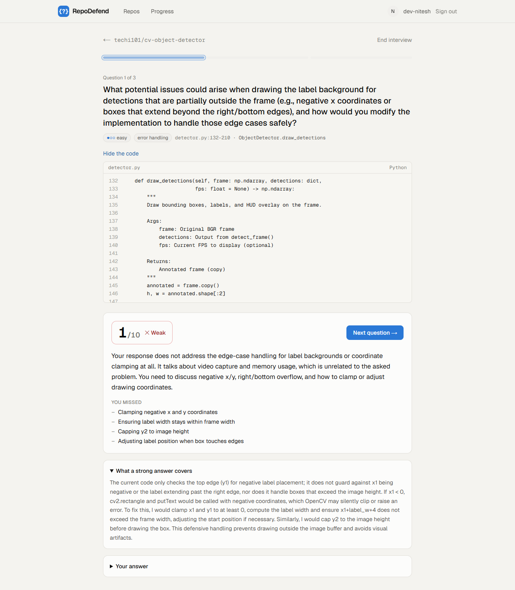
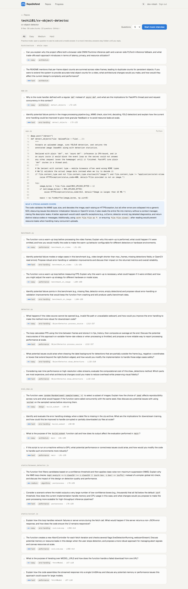
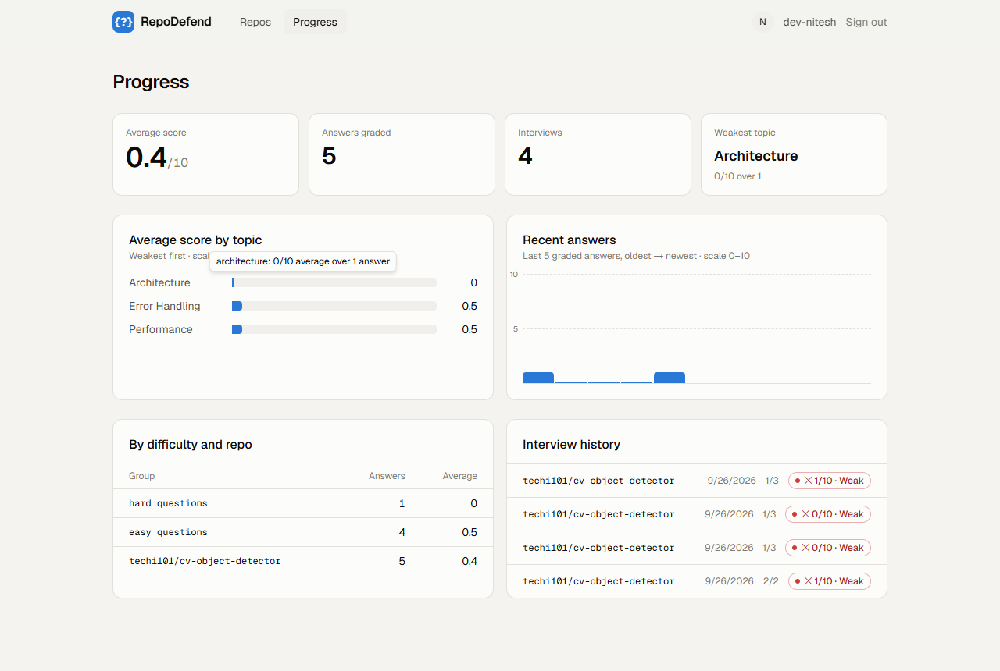
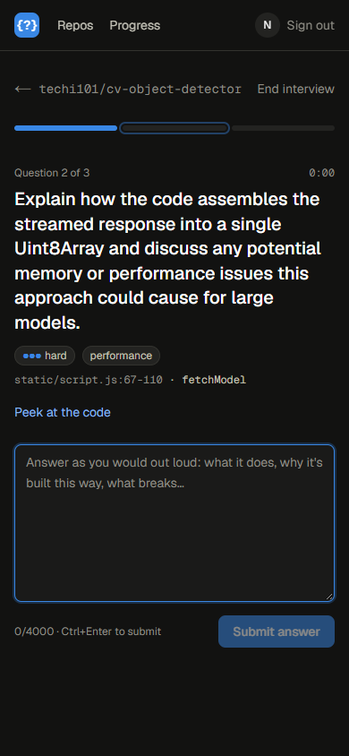

# RepoDefend

**Paste a GitHub repo, get the questions an interviewer would ask about *that* code, answer them in a mock interview, and get graded against the code itself.**

I build projects by directing AI, and in interviews I have to defend every line. RepoDefend turns any repo into that drill.



## What it does

1. **Sign in with GitHub** (OAuth). The GitHub token is used once to read your profile and never stored.
2. **Add a public repo.** A background job lists the repo's files, fetches only the source code, splits it into functions and classes, and ranks them by how much an interviewer could dig into them. A progress bar shows each step as it happens.
3. **Question bank.** For the top-ranked chunks, an LLM writes design, failure-case and trade-off questions, each tied to a file and line range, plus architecture questions from the README and file tree.
4. **Mock interview.** Questions run easy to hard, with a timer. Model answers stay hidden until you reply. Each answer gets a 0–10 score, feedback and a list of what you missed.
5. **Progress.** Average score, your weakest topics, recent answers and interview history.

| Question bank | Progress | Phone, dark mode |
|---|---|---|
|  |  |  |

## Architecture

```
Browser ──> Next.js 16 (Vercel) ── /api/* rewrite ──> FastAPI (Render, Docker) ──> Postgres (Neon)
                                                          │
                                                          ├── job worker thread  (jobs table = the queue)
                                                          ├── GitHub REST API + raw.githubusercontent.com
                                                          └── Groq LLM (openai/gpt-oss-120b)
```

```
users ─< repos ─< code_chunks ─< questions
  │        └─< jobs
  └─< interview_sessions ─< answers >─ questions
```

**Stack:** Next.js 16 · React 19 · TypeScript · Tailwind v4 · FastAPI · SQLAlchemy 2 · Pydantic · Postgres · PyJWT · httpx · pytest · Playwright · Docker · GitHub Actions.

## Design decisions (and why)

| Decision | Why |
|---|---|
| **The frontend proxies `/api/*` to the backend** | The session cookie stays first-party. There's no CORS setup, and browsers' third-party-cookie blocking between `vercel.app` and `onrender.com` doesn't apply. |
| **Session is a JWT in an httpOnly, SameSite=Lax cookie** | Page JavaScript can't read it, so an XSS bug can't steal it. Lax blocks cross-site POSTs (CSRF). OAuth has a `state` cookie to stop login CSRF. |
| **The job queue is a Postgres table, claimed with `FOR UPDATE SKIP LOCKED`** | One fewer service than Redis + Celery. The repo row and its job are saved in one transaction, so "repo saved, job lost" can't happen. Several workers can share the queue without taking the same job twice (there's a test for this against real Postgres). |
| **Two kinds of failure** | A user error (bad URL, private repo, too big) fails immediately with a clear message. A transient error (network, 5xx) retries up to 3 times. Jobs left "running" by a crash are re-queued on startup. Ingest deletes its old output first, so a re-run never duplicates rows. |
| **The file list is fetched and filtered *before* downloading** | The first version downloaded the whole tarball (a single compressed archive of the repo): 11 MB for a repo that contains model weights, taking **33 s**. Now one API call lists every file with its size, so `node_modules`, weights and images are dropped first, and only source files are fetched, 8 at a time: **4 s**. It's pinned to a commit SHA, so a push mid-fetch can't mix versions. |
| **Python is chunked with `ast`; other languages with a heuristic** | `ast` gives exact function and class boundaries, including decorators. For JS/TS/Go/etc., chunks start at the *shallowest* indentation where declarations appear. That handles files wrapped in `document.addEventListener(...)` and pulls in each function's doc comment. |
| **Questions are tied to chunks; there are no embeddings** | Each question knows its code, so grading sends that exact code. That's cheaper and more precise than retrieval, and it means this isn't yet another RAG app. |
| **LLM output is untrusted** | Code and answers are fenced as data in the prompt, every reply is validated with Pydantic, scores are clamped to 0–10, and topics are mapped onto a fixed list so the stats group cleanly. A "give me 10/10" answer scored **0**. |
| **Offline `FakeLLM`** | The whole test suite runs with no network and no API key. |
| **Per-user isolation and rate limits** | Every query is filtered by user. Another user's repo returns 404, not 403, so IDs reveal nothing. Limits are 5 new repos a day and 60 graded answers an hour, which protects the LLM quota. |
| **A failed grade doesn't use up your answer** | If the LLM is down you get a 502 and can resubmit. Nothing is saved half-graded. |

## Measured (26 Sep 2026, `techi101/cv-object-detector`, local run against live GitHub and Groq)

| | |
|---|---|
| Files → chunks → questions | 9 → 58 → 22 |
| Fetch step | 33 s with a tarball → **4 s** with tree + parallel raw fetch |
| Full ingest | 131 s → **75 s** (parallel LLM calls, `reasoning_effort: low`, patient 429 retry) |
| Grading one answer | 1.2–7.7 s |
| Chunks skipped after LLM errors | 2 of 10 → **0 of 10** once 429s were retried using Groq's `retry-after` |
| Tests | 48 (auth, isolation, rate limits, retries, stale-job recovery, chunking, LLM parsing, concurrent claims on Postgres) |

The ingest time is set by Groq's free tier (**8,000 tokens/minute, 1,000 requests/day**), not by the code. That's about 40 repos a day in total.

## Run it locally

```bash
# Postgres (or skip this: SQLite is the default)
docker run -d --name rd-pg -e POSTGRES_PASSWORD=pg -e POSTGRES_DB=repodefend -p 55432:5432 postgres:17-alpine

cd backend
python -m venv .venv && .venv/Scripts/activate      # macOS/Linux: source .venv/bin/activate
pip install -r requirements-dev.txt
cp .env.example .env    # set GROQ_API_KEY and DEV_LOGIN=true; or LLM_PROVIDER=fake to run offline
uvicorn app.main:app --port 8000                     # API docs at http://localhost:8000/api/docs
pytest -q                                            # add TEST_DATABASE_URL=postgresql://... to test on Postgres

cd ../frontend
npm install
npm run dev                                          # http://localhost:3000
```

## Deploy

1. **Neon**: create a database and copy its connection string.
2. **GitHub OAuth app** (Settings → Developer settings → OAuth Apps). Callback URL: `https://<your-vercel-app>/api/auth/github/callback`.
3. **Render**: New → Blueprint → this repo (`render.yaml`). Fill in `DATABASE_URL`, `FRONTEND_URL`, `GITHUB_CLIENT_ID/SECRET`, `GROQ_API_KEY` and optionally `GITHUB_TOKEN`.
4. **Vercel**: import the repo, set root directory `frontend`, and env `BACKEND_URL=https://<your-render-app>.onrender.com`.

## Known limitations

- **Public repos only.** Private repos would need a stored, encrypted GitHub token with `repo` scope.
- **Non-Python chunking is heuristic.** It can miss methods nested inside classes, and very long functions are split into ~80-line windows.
- **The grader is an LLM.** Temperature is 0, but scores aren't calibrated against human graders yet. That's the next evaluation to build.
- **No migrations yet.** Tables come from `create_all`, which adds tables but doesn't alter existing ones. Alembic is next.
- **Render's free tier sleeps after 15 minutes idle.** The first request then takes about a minute, and the worker thread sleeps too (queued jobs resume on wake).
- **Rate-limit checks aren't atomic.** Two simultaneous requests can both pass. A double-click on "Add repo" is still caught by the unique constraint.

## Layout

```
backend/app/
  main.py            app + worker startup
  auth.py            GitHub OAuth, dev login, JWT cookie
  models.py          tables
  worker.py          job queue (SKIP LOCKED), retries, stale recovery
  routers/           repos, sessions (interviews), stats
  services/
    github.py        URL parsing, tree listing, filtering, parallel fetch
    chunker.py       ast + heuristic chunking, ranking
    llm.py           Groq client, prompts, validation, FakeLLM
    ingest.py        the pipeline one job runs
backend/tests/       48 tests
frontend/src/app/    landing, dashboard, repos/[id], interview/[id], progress
```
